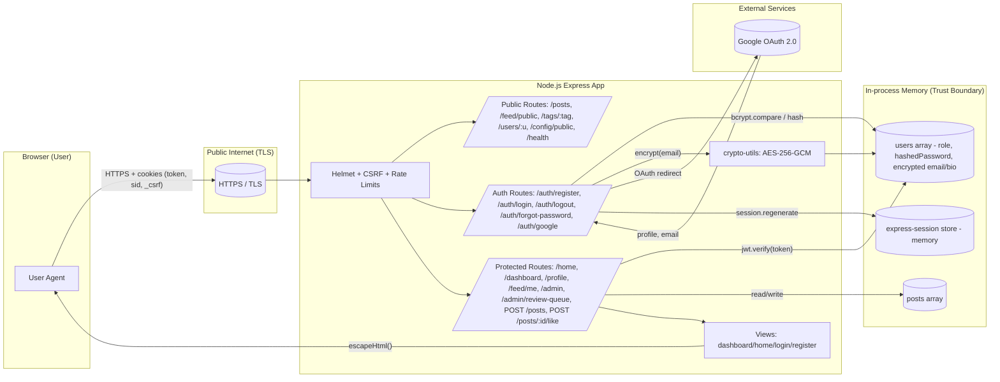

# Threat Model - Photo App WSF

This threat model reflects the actual state of the project: a single-process Node.js + Express HTTPS app with in-memory data, JWT-in-cookie auth, local sessions, local password auth plus optional Google OAuth, and server-rendered views.

## 1. System Overview

- Node.js + Express served over HTTPS (self-signed cert for local dev)
- Server-rendered HTML from `views/*.js` template functions
- In-memory `users[]` and `posts[]` arrays (no database, no persistent store)
- AES-256-GCM encryption for `email` and `bio` at rest (in-memory), bcrypt for passwords
- JWT in `httpOnly; secure; sameSite=strict` cookie for authentication
- `express-session` for flash messages / OAuth handshake state
- `csurf` (cookie mode) for CSRF protection on state-changing requests
- Helmet defaults for security headers
- Rate limiting on login, register, and forgot-password
- Optional Google OAuth 2.0 via passport-google-oauth20

## 2. Architecture & Data Flow (Mermaid)

### Trust boundaries
1. **Browser ↔ Server**: untrusted input crosses here; everything from the client must be validated, authenticated, and authorized.
2. **Server ↔ Google OAuth**: external identity provider; callback data is partially trusted but still validated before creating users.
3. **App ↔ In-memory store**: data never leaves the process; if the process is compromised, the store is compromised.

## 3. Assets

| Asset | Sensitivity | Notes |
|---|---|---|
| User credentials (password hashes) | High | bcrypt (cost 10); never logged |
| JWT secret | High | signs session tokens; must not leak |
| Session secret | High | signs session cookie; separate from JWT secret |
| AES encryption key | High | decrypts all `email` and `bio` values |
| User PII (email, bio) | Medium | encrypted with AES-256-GCM at rest |
| Role / authorization data | Medium | drives admin access |
| Posts / likes | Low | public data, minimal privacy impact |
| TLS private key | High | local self-signed, kept out of git |

## 4. Attack Vectors

- Direct HTTP(S) requests to protected routes (auth bypass)
- XSS payloads injected through registration, profile update, or post creation
- CSRF attacks against state-changing endpoints
- Brute-force / credential stuffing on `/auth/login`
- Spam / enumeration on `/auth/register` and `/auth/forgot-password`
- Session fixation on login
- Cached sensitive responses via shared/intermediate caches
- Secret leakage through committed `.env` or template files
- Dependency vulnerabilities (`npm audit` surface)
- Open-redirect / SSRF through `imageUrl` in post creation

## 5. STRIDE Threat Table

| # | Threat | STRIDE | Affected Area | Attack Vector | Likelihood | Impact | Risk | Existing / Applied Mitigation |
|---|---|---|---|---|---|---|---|---|
| T1 | Token / cookie theft via JS | Spoofing | `token` cookie | XSS or extension | Low | High | Medium | `httpOnly`, `secure`, `sameSite=strict` on JWT cookie; CSP via Helmet |
| T2 | CSRF on state-changing routes | Tampering | POST routes | cross-origin form | Medium | High | High | `csurf` cookie mode, `sameSite` on session + JWT cookies |
| T3 | Unauthenticated admin access | Elevation of Privilege | `/admin/review-queue` | direct GET | Medium | High | High | **Fixed:** now requires `authenticateJWTapi` + `authorizeRoles('Admin')` |
| T4 | Unauthenticated post creation | Tampering | `POST /posts` | direct POST | High | Medium | High | **Fixed:** now requires JWT; `author` taken from JWT, not body |
| T5 | Like inflation by anonymous users | Tampering | `POST /posts/:id/like` | direct POST | High | Low | Medium | **Fixed:** now requires JWT |
| T6 | Stored XSS via bio / caption | Tampering | profile + post create | malicious input | Medium | High | High | `express-validator` rejects HTML/special chars; output escaped in views |
| T7 | Credential stuffing / brute force | Spoofing | `/auth/login` | scripted POSTs | High | High | High | `express-rate-limit` 10 / 15 min; bcrypt hashing |
| T8 | Mass registration / abuse | Denial of Service | `/auth/register` | scripted POSTs | Medium | Medium | Medium | **Fixed:** `registerLimiter` 5 / hour; strict validation |
| T9 | Password reset abuse / enumeration | Information Disclosure | `/auth/forgot-password` | scripted POSTs | Medium | Medium | Medium | **Fixed:** rate-limited; generic response regardless of email existence |
| T10 | Weak / reused session key | Spoofing | session cookie | key compromise | Low | High | Medium | **Fixed:** separate `SESSION_SECRET` env var |
| T11 | Session cookie lacks sameSite | Tampering | session cookie | CSRF / cross-site | Medium | Medium | Medium | **Fixed:** `sameSite: 'lax'`, `httpOnly`, `secure`, `maxAge` set |
| T12 | Sensitive data cached by intermediaries | Information Disclosure | protected API responses | shared proxy / browser cache | Low | Medium | Medium | **Fixed:** `Cache-Control: no-store` now set in `authenticateJWTapi` as well as in `authenticateJWT` |
| T13 | Password hash leakage via session | Information Disclosure | `req.session.user` | memory dump / misuse | Low | High | Medium | **Fixed:** only `{id, username, role}` stored in session, not full user record |
| T14 | Secrets leaked via `.env.example` | Information Disclosure | repo | git leak | Low | High | Medium | `.env` gitignored; `.env.example` contains placeholders only; **added** `SESSION_SECRET` placeholder |
| T15 | PII leakage at rest | Information Disclosure | users array | process dump / logs | Low | Medium | Low | AES-256-GCM for email + bio; logs show ciphertext only |
| T16 | Password guessing / weak passwords | Spoofing | `/auth/register` | weak user choice | Medium | High | High | **Fixed:** min 8 chars, must contain letter + number |
| T17 | Dependency vulnerability | Various | `node_modules` | transitive CVE | Medium | Varies | Medium | `npm audit` + GitHub Actions workflow; `csurf` documented as deprecated |
| T18 | Open-redirect / SSRF via imageUrl | Information Disclosure | `POST /posts` | malicious URL | Low | Low | Low | **Fixed:** `imageUrl` validated against `http(s)://` or `/` path pattern, max length enforced |
| T19 | Session fixation | Spoofing | login flow | pre-login session reuse | Low | High | Medium | `req.session.regenerate()` after login + OAuth |
| T20 | Clickjacking / MIME sniff / missing HSTS | Tampering | all responses | framed page | Low | Medium | Low | Helmet defaults (frameguard, noSniff, HSTS on HTTPS) |

### Risk scoring

Likelihood and Impact are rated Low / Medium / High.
Risk = worst of (Likelihood, Impact), with a downgrade if a strong mitigation is already in place.

## 6. Residual Risks

- In-memory data is lost on restart; there is no persistent backup or audit log.
- `csurf` is deprecated. It is still effective but should be replaced in a future iteration.
- No anti-automation for OAuth callback.
- Self-signed cert only; production TLS and HSTS preload are out of scope for this course project.
- No structured logging or monitoring.
